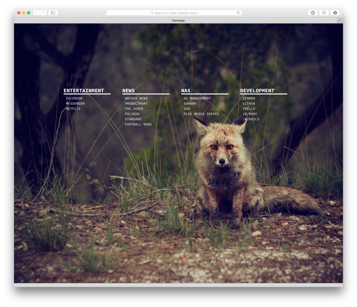

# Custom Browser Startpage



1. ````$ bundle install````
2. ````$ mv _data/bookmarks.example.yml _data/booksmarks.yml````
3. Edit / Add your own bookmarks
4. Choose one of the included background images from [unsplash.com](Unsplash) in ````_sass/_startpage.scss````
5. ````$ jekyll build````
6. Point your browser to  ````_site/index.html ````
